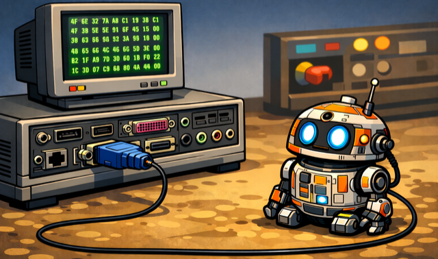

# DroidWire Serial Port Library



## Introduction
DroidWire is a small cross platform C++20 library for serial communications on Windows and Linux or Unix-like systems. It is designed as a low level transport library rather than a protocol framework. The library opens a serial device, applies the requested port settings, and then exposes raw byte oriented read and write operations.

In addition to the serial port class, DroidWire also provides a small buffer utility layer that is useful when building framed protocols on top of a byte stream. The buffer classes are intentionally simple and can be used to accumulate incoming data, inspect the valid bytes currently held, and consume bytes from the front once they have been processed.

This document is intended to be used as the main user guide for the library. It explains what the library provides, how the API behaves, and how to integrate DroidWire into your own programs.

## What the library provides
The public API is split into two headers:

- `#include <droidwire/droidwire.h>` provides the serial port API.
- `#include <droidwire/buffer.h>` provides the buffer utility classes.

The main types are:

- `DroidWire::SerialConfig` for describing how a serial port should be opened.
- `DroidWire::SerialPort` for reading from and writing to a serial device.
- `DroidWire::DynamicBuffer` for a growable byte buffer.
- `DroidWire::FixedBuffer<N>` for a fixed capacity byte buffer.
- `DroidWire::BufferInterface` for code that wants to operate on either buffer type through a common interface.

## Design overview
The library is intentionally byte oriented.

When a `DroidWire::SerialPort` object is constructed, the library:

1. opens the requested device
2. configures the port according to the supplied `SerialConfig`
3. keeps the operating system handle open for the lifetime of the object

After that, the application interacts with the device through two methods:

- `write(std::span<const std::byte>)`
- `read(std::span<std::byte>)`

Both functions return a subspan describing how many bytes were actually processed.

This is important because serial I/O is not guaranteed to consume the entire buffer in one call, especially in non-blocking mode. DroidWire does not internally loop until a whole message has been transferred. That responsibility is left to the application so that callers can choose their own retry, timeout, and framing strategy.

The library does not interpret text encodings, line endings, packet boundaries, or protocol frames. If your application needs those features, build them on top of the raw byte API.

## Building the library
DroidWire is built with CMake and currently produces a static library target named `droidwire`.

The project requires:

- CMake 3.16 or newer
- a C++20 compiler

To build the library as a standalone project:

```bash
cmake -S . -B build
cmake --build build
```

When DroidWire is built as the top level project, the repository also builds the `droidwire_test` example executable from `src/test/droidwire_test.cpp`.

## Using DroidWire in your own CMake project
The current repository defines the library target but does not provide an install/export package. There are two simple ways to use it in another CMake project.

### Using `add_subdirectory()`
If the DroidWire source is already available in your tree, add it as a normal subdirectory.

```cmake
add_subdirectory(path/to/droidwire)

add_executable(my_app
    src/main.cpp
)

target_link_libraries(my_app
    PRIVATE
    droidwire
)
```

The `droidwire` target publishes its `include/` directory as a public include path and enables C++20 on consumers.

### Using `FetchContent`
If you want CMake to download DroidWire during configure time, use `FetchContent`.

```cmake
include(FetchContent)

FetchContent_Declare(
    droidwire
    GIT_REPOSITORY https://github.com/0xcafed00d/droidwire.git
    GIT_TAG        <commit-or-tag>
)

FetchContent_MakeAvailable(droidwire)

add_executable(my_app
    src/main.cpp
)

target_link_libraries(my_app
    PRIVATE
    droidwire
)
```

In this setup:

- `FetchContent_Declare()` tells CMake where to fetch the DroidWire source from.
- `GIT_TAG` should be pinned to a specific tag or commit so that builds stay reproducible.
- `FetchContent_MakeAvailable(droidwire)` adds the library to your build in the same way as `add_subdirectory()`.
- your application still links against the same CMake target, `droidwire`

Because DroidWire only builds its `droidwire_test` executable when it is the top level project, using it through `FetchContent` will add the library target without also building the example program.

## Serial port API

### `SerialConfig`
`DroidWire::SerialConfig` describes the port that will be opened and how it should be configured.

```cpp
struct SerialConfig {
    std::string device;
    BaudSetting baudRate = BaudRate::Baud115200;
    Parity parity = Parity::None;
    StopBits stopBits = StopBits::One;
    FlowControl flowControl = FlowControl::None;
    std::chrono::milliseconds timeout = std::chrono::milliseconds{1000};
    bool non_blocking = false;
};
```

The fields are:

- `device` is the operating system device name to open.
- `baudRate` can be either a predefined `BaudRate` enum value or a custom unsigned integer baud value.
- `parity` selects `None`, `Even`, or `Odd`.
- `stopBits` selects one or two stop bits.
- `flowControl` selects `None`, `Hardware`, or `Software`.
- `timeout` is currently used by the Windows implementation to configure read timeouts.
- `non_blocking` selects blocking or non-blocking I/O behaviour.

The predefined baud values are:

- `Baud110`
- `Baud300`
- `Baud600`
- `Baud1200`
- `Baud2400`
- `Baud4800`
- `Baud9600`
- `Baud14400`
- `Baud19200`
- `Baud38400`
- `Baud57600`
- `Baud115200`
- `Baud128000`
- `Baud230400`
- `Baud256000`
- `Baud460800`
- `Baud921600`

`DroidWire::to_string()` can be used to turn either a `BaudRate` or a `BaudSetting` into a human readable string.

### `SerialPort`
`DroidWire::SerialPort` owns the operating system handle for an open serial device.

Important characteristics of the class are:

- it opens and configures the port in the constructor
- it closes the port in the destructor
- it is moveable
- it is not copyable

Typical construction looks like this:

```cpp
#include <chrono>
#include <droidwire/droidwire.h>

DroidWire::SerialConfig config;
config.device = "/dev/ttyUSB0";
config.baudRate = DroidWire::BaudRate::Baud115200;
config.parity = DroidWire::Parity::None;
config.stopBits = DroidWire::StopBits::One;
config.flowControl = DroidWire::FlowControl::None;
config.timeout = std::chrono::milliseconds{1000};
config.non_blocking = false;

DroidWire::SerialPort port(config);
```

On Windows the device name would typically be something like `COM3`. For ports above `COM9`, Windows applications commonly need the full device form such as `\\\\.\\COM10`.

On Linux and other Unix-like systems the device name is commonly something like `/dev/ttyUSB0`, `/dev/ttyACM0`, or `/dev/ttyS0`.

## Reading and writing data

### Writing data
The write function accepts a span of bytes and returns a subspan of the original input showing how many bytes were actually written.

```cpp
std::string command = "ATI\r\n";
auto bytes = std::as_bytes(std::span(command.data(), command.size()));

auto written = port.write(bytes);
```

If `written.size()` is smaller than `bytes.size()`, the remaining bytes were not accepted by the operating system in that call. This can happen in either blocking or non-blocking mode, although it is more common in non-blocking mode.

If your application needs to guarantee that the entire payload is sent, loop until the remaining span is empty:

```cpp
std::string command = "ATI\r\n";
auto remaining = std::as_bytes(std::span(command.data(), command.size()));

while (!remaining.empty()) {
    auto sent = port.write(remaining);
    remaining = remaining.subspan(sent.size());
}
```

### Reading data
The read function takes a writable caller supplied buffer and returns a subspan describing the valid bytes that were received.

```cpp
#include <array>

std::array<std::byte, 256> rx{};
auto received = port.read(rx);
```

If `received.size()` is zero, no bytes were returned by that call.

The returned span refers to the storage that you supplied. Process or copy the data before the buffer is reused.

For text based protocols you can convert the received bytes into a string like this:

```cpp
std::array<std::byte, 256> rx{};
auto received = port.read(rx);

std::string reply(reinterpret_cast<const char*>(rx.data()), received.size());
```

For binary protocols it is usually better to work directly with the returned span.

## Blocking and non-blocking operation

### Blocking mode
When `non_blocking` is `false`, the serial port is opened in blocking mode.

In blocking mode:

- `read()` may wait until data is available
- `write()` may wait until the operating system accepts data
- the exact wait behaviour is platform dependent

### Non-blocking mode
When `non_blocking` is `true`, the serial port is opened in non-blocking mode.

In non-blocking mode:

- `read()` returns immediately
- `write()` may write only part of the requested data
- either operation may return an empty span when no progress can be made immediately

The normal pattern for non-blocking code is to call `read()` or `write()` repeatedly from an application loop and handle partial progress explicitly.

Example polling loop:

```cpp
#include <array>
#include <thread>

std::array<std::byte, 256> rx{};

for (;;) {
    auto received = port.read(rx);
    if (!received.empty()) {
        // Process the bytes in received.
    }

    std::this_thread::sleep_for(std::chrono::milliseconds(10));
}
```

## Buffer utilities
The buffer classes in `buffer.h` are intended for applications that need to accumulate data from the serial stream until a full message or frame is available.

### `BufferInterface`
`BufferInterface` defines a minimal common API:

- `capacity()`
- `size()`
- `data()`
- `append()`
- `consume()`

The interface works in terms of `std::byte` spans and is suitable for code that wants to accept either a dynamic or fixed buffer implementation.

### `DynamicBuffer`
`DynamicBuffer` stores bytes in a `std::vector<std::byte>` and grows as required.

Important behaviour:

- the constructor argument reserves initial capacity but does not add valid data
- `append()` adds bytes to the end of the valid region
- `data()` returns only the valid bytes currently held
- `consume(count)` removes bytes from the front of the buffer

Example:

```cpp
#include <array>
#include <droidwire/buffer.h>

DroidWire::DynamicBuffer buffer(512);
std::array<std::byte, 128> rx{};

auto received = port.read(rx);
buffer.append(received);

if (buffer.size() >= 4) {
    auto header = buffer.data().first(4);
    // Parse header...
    buffer.consume(4);
}
```

`DynamicBuffer` is useful when message sizes are not fixed or when the amount of unread data can vary.

### `FixedBuffer<N>`
`FixedBuffer<N>` stores bytes in a compile time sized `std::array<std::byte, N>`.

Important behaviour:

- capacity is fixed at compile time
- `append()` throws `std::out_of_range` if the new data would exceed the capacity
- `consume(count)` throws `std::out_of_range` if more bytes are consumed than are present

Example:

```cpp
#include <droidwire/buffer.h>

DroidWire::FixedBuffer<256> buffer;
buffer.append(std::span<const std::byte>{some_bytes, some_size});
```

`FixedBuffer<N>` is useful when your protocol has a known upper bound and you want deterministic memory usage.

## Complete example
The following example opens a serial port, sends a command, and then reads a reply.

```cpp
#include <array>
#include <chrono>
#include <droidwire/droidwire.h>
#include <iostream>
#include <string>
#include <thread>

int main() {
    DroidWire::SerialConfig config;
#ifdef _WIN32
    config.device = "COM3";
#else
    config.device = "/dev/ttyUSB0";
#endif
    config.baudRate = DroidWire::BaudRate::Baud115200;
    config.timeout = std::chrono::milliseconds{1000};
    config.non_blocking = false;

    try {
        DroidWire::SerialPort port(config);

        std::string command = "ATI\r\n";
        auto remaining = std::as_bytes(std::span(command.data(), command.size()));

        while (!remaining.empty()) {
            auto sent = port.write(remaining);
            remaining = remaining.subspan(sent.size());
        }

        // Pause briefly to give the device time to generate a reply.
        std::this_thread::sleep_for(std::chrono::milliseconds(500));

        std::array<std::byte, 256> rx{};
        auto received = port.read(rx);

        std::string reply(reinterpret_cast<const char*>(rx.data()), received.size());
        std::cout << "Received " << received.size() << " bytes: " << reply << '\n';
    } catch (const std::exception& ex) {
        std::cerr << "Serial error: " << ex.what() << '\n';
        return 1;
    }

    return 0;
}
```

## Error handling
DroidWire reports errors by throwing standard C++ exceptions.

The most important cases are:

- `std::system_error` for operating system failures such as open, read, write, or serial configuration errors
- `std::invalid_argument` for unsupported baud rate settings
- `std::out_of_range` for invalid buffer operations such as consuming more bytes than are present

Applications should normally construct the port inside a `try` block and handle exceptions at the point where the program can decide whether to retry, report an error, or shut down cleanly.

## Platform notes
The library uses different operating system APIs on each platform.

On Windows:

- serial ports are opened with `CreateFileW`
- configuration is applied through the Windows communications API
- the `timeout` setting is used to configure read timeouts
- parity, stop bits, and flow control settings are applied from `SerialConfig`

On Linux and Unix-like systems:

- serial ports are opened as file descriptors
- the implementation uses POSIX style serial APIs
- non-blocking reads poll with `select()` before calling `read()`
- custom integer baud rates depend on platform support and may not be available everywhere

Users should also be aware of the current implementation details on POSIX systems:

- the `timeout` field exists in the public API, but the current POSIX implementation does not apply it through `termios`
- the current POSIX implementation configures the device in raw 8 bit mode and does not currently apply the `parity`, `stopBits`, or `flowControl` settings from `SerialConfig`

These details matter when writing portable applications. If you need behaviour that is identical across Windows and POSIX systems, test the target platform rather than assuming that every setting is currently implemented in exactly the same way.

## Typical usage pattern
Most applications using DroidWire follow a structure like this:

1. create a `SerialConfig`
2. construct a `SerialPort`
3. convert outgoing data into `std::byte` spans and send it with `write()`
4. read incoming data into a caller supplied buffer with `read()`
5. if messages can arrive in pieces, append the bytes into a `DynamicBuffer` or `FixedBuffer<N>`
6. parse complete frames from the buffer and call `consume()` for the bytes that were handled

This keeps DroidWire focused on transport while allowing application code to implement whatever framing, command protocol, retry policy, or message parser is appropriate for the device being controlled.
